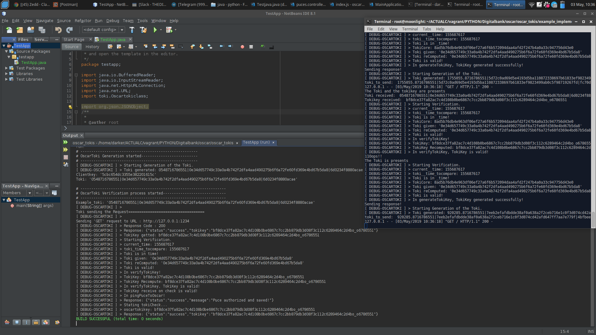

# Java - Python

A simple implementation of a test of communication between a microservice and a client using Oscartoki protocol

## Requirements

- For the client, we need : `axios`
- For the microservie, we need: `flask`

## How to test

### Run The test-Communication:

- Fist you need to start the Python server, just run this command:
```shell
python fake_microservice.py
```

- Second Launch the TestApp.jar running this command on another CLI:
```shell
ce TestApp/dist/
java -jar TestApp.jar
```



### What will be done

- The client will sent a request to the microservice with a generated oscartoki in header.
- The microservice will get the oscartoki parameter, will verify it before proceed and generate it's own toki key to send to the client.
- The client receive the toki key, Verify it and send the real request to the microservice.
- The Microservice receive the request with tokikey and tokis generated and proceed.

That's all, in fact it's most compilcated than tis explanation but that's basics to understand what is done in this example of implementation.

## Author

- Sanix darker (Ange SAADJIO)